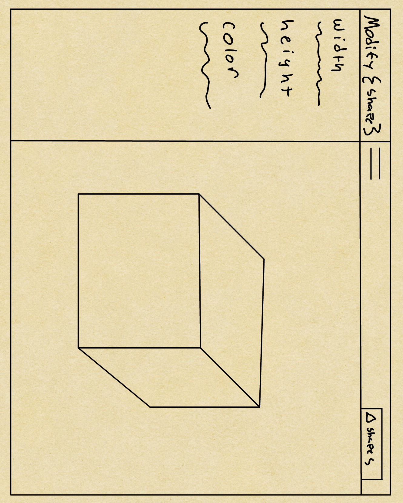

# 2D Graphics Modeler

## Contributors
| Member           | Roles          | 
|------------------|----------------|
| Connor Darling   | Product Owner  |
| Carlos Aguilera  | SCRUM Master   |
| Supernova1114    | Team Member    |
| Catatonic2003    | Team Member    |
| jbobby0__        | Team Member    |

 

## Overview 
This project models as a library for basic 2D graphical objects.
The goal is to exercise C++ fundamentals to construct this project
such as inheritance, aggregation, polymorphism, exception handling,
templates, operator overloading, and move semantics. There is a 
Shape class interface that allows all other shapes to derive from it.
To store these shapes, a custom vector class is implemented using a
basic iterator member type with `begin()` and `end()` methods.
To sort the vector of shape objects, a custom selection sort algorithm
is implemented using templated functions to compare perimeter and area.

The program is created using the gui library `Qt`. Specifically `QPainter` 
and `QWidgets` are used to render shapes and text on the screen. The user
interface is designed to be readable and simple, while still being able to handle
contingencies such as invalid input. In addition to output of text
and shapes in the window, the program allows a user to manipulate size, color,
and location.

Our team has strongly enforced an agile development methodology. These methods include:
- Following a scrum procress of assigning a scrum master, product owner and team member role
- Creating user stories to help with the implementation of features
- Creating UML class diagrams, both use case and state diagrams

## User Interface Design
The following image shows an early design of the graphical user interface. Features include:
- Choose demo shapes using a header pane
- A collapsable side navigation bar to modify any default attribute of a given shape
- Settings header pane for user settings, contact information, and save and exit

## Sprints

  | (Sprint #1) Estimated Time: 3 weeks |
  | :---------------------------------: |
  
- [ ] implement shapes.txt parser object/logic  
- [ ] implement vector container 
- [ ] begin implementation of shape abc interface & inheritance hierarchy (line, polyline ...) 
- [ ] investigate/understand qt qpainter demo project 
- [ ] build basic 2d modeler qt project with login screen 

 

  | (Sprint #2) Estimated Time: 3 weeks |
  | :---------------------------------: |
  
- [ ] complete implementation of shape abc interface & inheritance hierarchy (line, polyline ...)
- [ ] ability to render 2d shapes (2d modeler qt project)
- [ ] renderarea widget (inherits from qwidget like qt 2d rendering demo project) can dislpay all geometric shapes
- [ ] ability to render all shapes from shapes.txt in renderarea widget (2d modeler qt project)
- [ ] reports to display shapes, shape perimeter & area (2d modeler qt project)
- [ ] update 2d shapes (i.e. add, remove or move) via rendering widget forms (2d modeler qt project)
- [ ] persist changes to shapes.txt file
